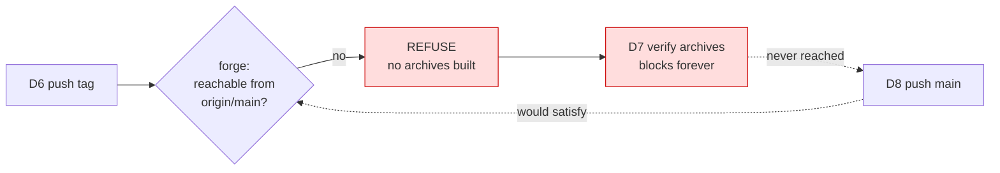
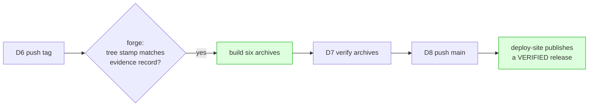

# v0.5.2 — the release that can release itself

**Status:** design, approved 10 Aug 2026. Awaiting an implementation plan.
**Bump:** `v0.5.1` → `v0.5.2`, patch.
**Predecessor:** `v0.5.1`, shipped 10 Aug 2026, tag on merge commit `8c3a9c1`.

## What this release is for

The v0.5.1 release ran to completion only because a human executed the driver's printed
recovery by hand. Two guards, each correct alone, compose into a deadlock that the next
release hits the same way. That is the headline of v0.5.2; everything else is a sweep of
what the v0.5.0 and v0.5.1 gates surfaced and deliberately deferred.

Of the eleven open issues, eight are fixed, two are closed without work because the tree
already fixes them, and one is deferred to a release of its own. Four follow-ups the v0.5.1
gate raised outside the issue tracker ride along, the largest of which — lane 6 — retires a
whole class of gate finding rather than the findings themselves.

## Issue disposition

| # | Title | Disposition |
|---|---|---|
| 39 | release gate: the clean-install check cannot detect the failure it exists for | **Close, no work.** Already fixed. |
| 35 | release-checklist: the whenToUse example still names v0.4.0 | **Close, no work.** File deleted. |
| 40 | release process: a release branch named vX.Y.Z collides with the tag it becomes | Lane 1b |
| 33 | goreleaser: the release page never shows the BREAKING notice | Lane 1c |
| 38 | goreleaser: the release archive prints 0.5.0, go install prints v0.5.0 | Lane 2 |
| 31 | build_role: no phase for a declared contract that implementations conform to | Lane 3a |
| 34 | site: the CLI card omits GET /api/graph, and the claims graph appears nowhere but the release entry | Lane 3b |
| 36 | viewer-tests: a local green says nothing about Windows, and the browser is whatever was found | Lane 3c |
| 29 | components_test: the summary dash guard is weaker than its comment claims | Lane 4a |
| 28 | viewer-tests: the `</details>` ordering probe is fixture-dependent | Lane 4b |
| 37 | site: make the site the human's source of truth, and gate it every release | **Deferred.** See below. |

### Why #39 and #35 close without a commit

**#39** asked that the ldflags assertion move off the `go install` path, which cannot carry
it, and onto the published archive, which can. `docs/RELEASING.md:608-630` already does
exactly that: the `go install` leg is kept for what it does prove (the proxy serves the tag,
the tagged source builds and runs) and a second item downloads the archive and rests the
verdict on `go version -m`'s `build -ldflags=` line. The file the issue names,
`.claude/workflows/release-checklist.js`, no longer exists.

**#35** is a stale illustrative version inside that same deleted file.

Both should be closed with a comment naming the commit or release that fixed them, not
silently.

### Why #37 is deferred

It is not a patch. It ports a v0.3.0-era worktree of 36 prerendered routes and ~9,100 words
onto a fresh branch, rewrites the content for two releases of product change, adds a claims
graph pane and a live demo, and stands up a new `site-currency` pre-merge gate surface. It
also carries three unresolved design questions from the July spec (`/system` authorship, a
phone design, whether light-only still stands). It gets its own release and its own spec.

Because #37 is deferred, **#34 is patched in place** rather than absorbed by the redesign.

---

## Lane 1 — the pipeline can complete unattended

### 1a. The driver/forge deadlock

No issue tracks this. It comes from the v0.5.1 release run, where D7 polled for twenty
minutes, the forge kept refusing, and the driver stopped with the tag public and nothing
else done.

Two guards, each proven alone by its own mutation test:

- The **driver** pushes the tag before main, so the site never announces a release whose
  archives do not exist (`cmd/dossierx/gate_driver_test.go:427-431`, asserted at `:1824`).
- The **forge** refuses a tag not reachable from `origin/main`, so unmerged code never ships
  (`.github/workflows/release.yml:85-95`).

Together they are circular. No amount of patience on either side resolves it:



The driver blocks on archives; the archives need the forge; the forge needs main; main is
pushed after the block. One guard has to move.

**Decision: the forge drops the reachability check and keeps the tree stamp.** The driver's
order is untouched, so the property that order was designed to buy — archives verified green
before `deploy-site` publishes a page announcing them — survives whole.



**What is given up, and why it is acceptable.** Guard (a) existed so that a tag someone
pushed at a branch by hand could not ship — "the release is a thing that was merged"
(`release.yml:14`). That threat is still refused, by guard (b): a hand-pushed tag names a
tree for which no gate evidence record exists, and the forge refuses a tree no record
accounts for. Reachability was a second lock on the same door, not the only lock.

**This argument must be written down in both places, or the next reader restores the check
and re-creates the deadlock.** `release.yml`'s header comment currently states reachability
as load-bearing; that comment is now wrong and is part of the change. `docs/RELEASING.md`
gets the same account.

Files: `.github/workflows/release.yml` (guard and header comment) and `docs/RELEASING.md`.

**No Go test pins the forge's guard list.** `.github/workflows/release.yml` is read by
`gate_release_stamp_test.go` only to derive which GoReleaser config the publish step opens,
and by nothing else. So deleting guard (a) is invisible to `go test ./...`, and the two prose
accounts above are the *entire* record of why it went. Writing them is not documentation
that trails the change — it is the only artifact that survives it.

### 1b. Fully-qualified refs and a branch-naming rule (#40)

`docs/RELEASING.md:535` still prescribes `git push origin vX.Y.Z` for a human. On a release
developed on a branch named `vX.Y.Z`, that command fails outright (`src refspec matches more
than one`), and the checklist's `git rev-parse --short vX.Y.Z^{commit}` resolves correctly
only by git's search-order convention while a branch and a tag of the same name point at
different commits.

Two changes, both cheap, and both wanted:

1. The human-path commands in `docs/RELEASING.md` use fully-qualified refs —
   `refs/tags/vX.Y.Z` — in the push and in any `rev-parse`. They are then correct regardless
   of what branches exist.
2. `docs/RELEASING.md` states the branch-naming rule: a release branch is
   `release/vX.Y.Z` or `worktree-*`, never bare `vX.Y.Z`.

The driver already pushes fully-qualified (`gate_driver_test.go:902`,
`TagObj+":refs/tags/"+plan.Version`), so this closes the gap between what the machine does
and what the document tells a person to do.

### 1c. A release footer that reaches the reader (#33)

`.goreleaser.yaml`'s `release:` block sets no `header`, `footer` or `body`, so a published
release page carries only grouped commit subjects. v0.5.0's breaking change appeared there
as an ordinary Features bullet with no BREAKING framing and no pointer to the recovery
steps.

Add a `release.footer` linking to the CHANGELOG entry for the version being published, so
every future release page points at the place breaking changes are actually explained. This
is about reach, not correctness — the hand-written CHANGELOG entry is substantive and is not
being replaced by generated notes.

---

## Lane 2 — one canonical version string (#38)

Today the same release reports two different version strings depending on how it was
installed: the published archive prints `0.5.1`, `go install` prints `v0.5.1`. GoReleaser's
`{{.Version}}` strips the leading `v`; the module proxy hands `info.Main.Version` the tag
verbatim.

v0.5.1 did not fix this — it institutionalized it, adding `latestBinaryVersion` to
`site/src/content.ts:299` so the site could depict both forms without lying.

**Decision: `v`-prefixed is canonical.** `.goreleaser.yaml` moves to `{{.Tag}}`, so the
archive, `go install`, the tag, the CHANGELOG heading and every string on the site all read
`v0.5.2`. `cmd/dossierx/main.go` does not change: `resolveVersionInfo` already produces the
tag verbatim on the no-ldflags path, which is the target form.

### The tree already contains this lane's to-do list

`cmd/dossierx/gate_release_stamp_test.go:1294-1298` refuses the `{{.Tag}}` move by name and
says what else must move with it: *"gateReleaseBinaryVersion strips one, and
site/src/content.ts derives `latestBinaryVersion` by stripping one, so both sides of every
comparison in this file are now wrong in the same direction and cannot disagree… Update this
file's model and the site's derivation together, or put the template back."*

That is the specification. Five files move as one change:

| File | Change |
|---|---|
| `.goreleaser.yaml` | `-X main.version={{.Version}}` → `-X main.version={{.Tag}}` |
| `cmd/dossierx/gate_release_stamp_test.go` | `gateVersionTemplate` becomes `{{.Tag}}`; the refusal at `:1294` inverts to refuse `{{.Version}}`; `gateReleaseBinaryVersion` stops stripping; the stamp table at `:1122`; the `latestBinaryVersion` pin at `:470-473`; the measurement record at `:55-90` |
| `site/src/content.ts` | delete `latestBinaryVersion` (`:299`) and its rationale comment (`:290-299`); the `dossierx version` example at `:1217` reads `latestVersion` |
| `viewer-tests/site_source_test.go:553`, `viewer-tests/site_toolchain_test.go:902` | drop the strip model |
| `docs/RELEASING.md:418-423` | delete the paragraph explaining the split; there is no split |

### The hazard this lane must not re-open

`gate_release_stamp_test.go:245` records a measured defeat: a shadowing `.goreleaser.yml`
carrying `{{.Tag}}` left `go test ./...` green across the root module, because every
assertion was made — correctly — about a file the release does not open. The fix was to stop
treating the config path as a constant: `gateRequireGoreleaserConfigIsLoaded` derives the
subject from the publishing workflow's GoReleaser step and its `--config` argument, and every
read goes through `gateLoadGoreleaser`.

**That derivation stays exactly as it is.** Only the expected template flips. An
implementation that hard-codes a path while flipping the template re-opens the class this
file exists to remove.

---

## Lane 3 — docs rulings

### 3a. `schema` covers declared contracts (#31)

The five build phases have no slot for a declared contract that implementations conform to.
A module documented at two levels produces a declaration (`api`) and an implementation
(`behavior`) per entry point, with the implementation resting on the declaration — and
`behavior` builds before `api`, so every such edge is a forward reference. The reporter
measured 35 of 70 forward references in one module from this single cause.

**Decision: widen `schema` in the documentation.** It is described as covering *anything that
must exist before the things below it can conform to it* — data shapes and declared
contracts alike — rather than data shapes alone. This matches the phase's existing positional
meaning ("build first; everything below assumes these types exist") and blesses the
workaround the reporter already found works.

No code changes. `internal/buildorder` is untouched, no corpus revalidates, and no locked
build order can go stale as a result. That is why this option was chosen over teaching the
sort to place `api` before `behavior` conditionally, which would be a sort-behavior change
inside a patch release and could report a locked order stale with no edit on the project's
side — the same surprise class as v0.5.0's `mixed-cycle`.

The residual oddity is stated in the docs rather than papered over: a module whose whole
purpose is a public API can end up with an empty `api` phase, and that reads wrong to a human
even when the sequence is right.

Files: `FORMAT.md:410-442`, `skills/dossierx-build-order/SKILL.md`, and the site's account of
`build_role`. Changing `skills/**` makes the exported bundle a different bundle, so the
CHANGELOG entry must carry the `dossierx skills export` re-export notice.

### 3b. The site describes what shipped (#34)

Two gaps, both patched in place because #37 is deferred:

1. The `serve` card (`site/src/content.ts:1160`) describes only the comment write-back API.
   v0.5.0 added `GET /api/graph`, which backs the graph pane's refresh button.
2. The claims graph — v0.5.0's headline feature — appears nowhere on the site outside the
   v0.5.0 release entry. The Hero, Lifecycle and Comments sections still describe the viewer
   as cards plus a comment panel. A reader who never opens the release history does not learn
   it shipped.

### 3c. What a local green does not prove (#36)

v0.5.1 already landed the `DOSSIERX_TEST_BROWSER` table (`CONTRIBUTING.md:50`) and the note
that CI runs `hook-test` on three platforms (`:64`). What is still unsaid is the ranking, and
the ranking is the point:

- A local `make hook-test` PASS covers one of three legs. The hook body executes under git's
  own bundled `sh`, which differs per platform, so **the CI `git hook` matrix is the
  authoritative result** and a local pass is fast feedback, not evidence.
- `resolveBrowser` falls back to Comet, a Chromium fork, when no Chrome or Chromium is
  installed. That is not theoretical: Comet posts Sentry telemetry through a path containing
  `/api/`, and `graph_offline_test.go` was reading 118 of 119 request events as the page's
  own until v0.5.0 attributed requests by CDP `DocumentURL`. **A green against a fork is not
  a green against Chrome.**

Comet stays in the candidate list: on a machine with no other browser, removing it means the
suite cannot run locally at all.

Files: `CONTRIBUTING.md`. Whether release verification should pin the browser is left open
deliberately — it belongs with #37's gate work, not here.

---

## Lane 4 — two half-armed test guards

Both were found in the v0.4.1 regression pass and deliberately left then, to keep that
release's diff to what had been reviewed. Neither can produce a wrong result today; both
advertise more than they check.

### 4a. The dash guard checks one dash (#29)

`internal/render/components/components_test.go:465-476`. The comment says the separator must
be a plain ASCII hyphen, "never the en dash or the em dash this repo's prose uses". The
self-check loop scans the *expected* string for both. The assertion against actual output
checks only the en dash (`:473`).

The em dash is a live character in this same emitter: `EdgesHTMLWithLinks` writes
`governed_by: none — <reason>`. So the fix is not to add a second whole-output check, which
would fail wrongly — **scope both checks to the summary substring** and assert both dashes
against it.

### 4b. The ordering probe finds the wrong closer (#28)

`internal/render/components/comments_test.go:182`. `strings.Index(got, "</details>")` takes
the *first* closer, which is the footer's only because this fixture claim happens to carry a
`rests_on` edge. On a claim with no edges but with resolved comment threads, the footer is
suppressed (correct since v0.4.1) and the same literal finds the comments panel's own
`<details class="comments-resolved">` closer — so `panelIdx < closeIdx` compares the panel
against itself.

**Delete the probe.** The exact-adjacency assertion two lines above (`:178`) already proves
the ordering by matching `</ul></details><div class="comments-panel"` as a single string. A
redundant assertion that can silently degrade is worse than no assertion.

---

## Lane 5 — v0.5.1 gate follow-ups

Three small follow-ups the v0.5.1 gate raised outside the issue tracker. The fourth,
bundle-spec widening, is large enough to be its own lane and is below.

### 5a. The fanout flag-contract tests

Two fanout flag-contract tests assert that a release artifact is **absent**. During a
mid-release checkout the artifact exists, so they redden the very tree the gate is reading.
This one is self-serving: fixing it stops v0.5.2's own gate run producing a finding about
v0.5.2.

### 5b. The docs sweep

Roughly 24 under-floor findings from gate round 3, all already adjudicated by the maintainer
and delegated. Known members: `codes.go` naming the retired `dossierx flag`, `FORMAT.md`'s
`mockup_modules`, and the exported skill bundle's content rule. Wide but shallow, and no new
decisions — each already has a ruling. The full list is in the round-3 gate record.

### 5c. A CI value for the `cli-operator` vocabulary

The closed vocabulary has no value meaning "CI runs it, a human reads it", so the maintainer
overrode the `cli-operator` subject by hand in gate round 3. Without a new value, that hand
override is required at every future release.

### Not in this release

- **The Windows file-lock flake class.** Three different tests flaked across three CI
  attempts on Windows, same class, no root cause yet. Diagnosis is unbounded and a flake hunt
  could hold the release on a red matrix. Deferred.

---

## Lane 6 — dissolve the "byte I needed" class

Every gate round produces findings of one recurring shape: an agent says it could not answer
a question because a byte it needed was not in its message. Those findings are correct, and
the agent is doing exactly what it was told — but they are findings about the **gate's own
material**, not about the release, and they arrive fresh every round.

### Why they are structural, not incidental

Three rules compose into it, and each is right on its own:

1. `surfaces.yaml` claims every tracked file for **exactly one** surface. The manifest test
   enforces "exactly one, not at least one", so a surface cannot quietly swallow a file
   another surface also claims.
2. `gateStage2BundleSpec` partitions that one surface's resolved document set into `Handed`
   (bytes go in) and `Withheld` (named, bytes stay out). Together they must be the whole set.
3. `gate/prompts/_frame.md` rule 2 tells the agent that a byte it does not hold is never a
   reason to guess and never a reason to pass: *"report FAILED and name the byte you needed."*

So a sentence in `CONTRIBUTING.md` whose truth turns on `docs/RELEASING.md` is **unanswerable
by construction**. That file belongs to another surface, so it is not handed, not withheld,
and not present at all. Thirteen agents, thirteen chances, every round.

### The change

**A surface may declare documents outside its own claim that its agent needs as context.**

```
surfaces.yaml
  - name: contributing
    paths: [CONTRIBUTING.md]
    reads: [docs/RELEASING.md, Makefile]      # new

gateBundleSpec
    Handed     []string   # the surface's own, bytes in
    Withheld   []string   # the surface's own, named only
    Referenced []string   # NOT the surface's own, bytes in   <- new
```

`Referenced` is a third list, asserted **disjoint** from both others, so the existing totality
invariant — `Handed + Withheld` is exactly the manifest-resolved set — is untouched and stays
enforceable. Referenced bytes reach the surface key through the bundle digest like everything
else, so editing `docs/RELEASING.md` re-runs the surfaces that declared it and no others.

Rules that fall out and must be built, not assumed:

- **A `reads:` path that does not resolve is a refusal**, through
  `errGateBundleIncomplete`, not a shorter bundle. Same reasoning as every other refusal in
  the assembler: a bundle assembled over less than it should be still hashes, still looks like
  a match, and still carries a verdict forward.
- **A `reads:` path already in the same surface's `paths:` is refused**, exactly as a document
  appearing in both `Handed` and `Withheld` is refused today — it hands over bytes while
  telling the agent something else about them.
- **`reads:` must not count toward the manifest's exactly-one rule.** That rule is about
  `paths:`. An implementation that lets `tests/surfaces_manifest_test.go` see `reads:` as a
  second claim reddens the tree the moment the first entry lands.

### The reporting half, which is what actually dissolves the class

A byte the agent still does not hold stops being only a finding about the tree and becomes
**a named defect in the bundle spec**, whose fix is to add the path to that surface's `reads:`
and re-run. Because `reads:` is declared and finite, each gap is fixed once and that pair
cannot recur. The class shrinks monotonically instead of regenerating.

**Nothing is filtered.** The finding still reaches the human unchanged — that rule does not
bend. What is added is the second reading of it: this one is answerable by editing the gate's
material rather than the release's.

### The frame has to distinguish three states, not two

Rule 3 currently reads: *"A section marked 'not handed over' is still part of your surface."*
A referenced document is the opposite — handed, and **not** the agent's surface. Left unsaid,
an agent will file findings about another surface's documents under its own name, and since
nothing may be filtered, those reach the human as duplicates attributed to the wrong surface.

So the frame gains the third state explicitly: **yours and handed**, **yours and withheld**,
**handed as context and not yours**. The assembler already renders each part's `Source` path
for precisely this reason, so a finding can name which document it rests on and a human can
see it came in by reference.

### Why this is patch-safe

Every file involved is gate machinery: test code, not a cobra command, not compiled into the
shipped binary, outside `surface.json`'s `behaviour_fingerprint`. No consumer-visible
behaviour moves. It is nonetheless the largest single item in this release, and the one most
likely to grow during implementation.

---

## Release machinery

Ordinary for any release, listed so the plan does not omit it:

- The four install pins move to `v0.5.2`, one of them inside `skills/dossierx/SKILL.md`.
- Because `skills/**` changes (lane 3a and the pin), the CHANGELOG entry carries the
  **SILENT** re-export notice: a consumer must re-run `dossierx skills export`, and nothing in
  `dossierx check` will tell them so.
- The three committed sample viewers regenerate last, after the renderer, lint and CSS are
  final.
- The site's `releases[]` gains a `v0.5.2` entry, and carries no `commit` field.
- `make ci-evidence` runs for the tree being released; the driver refuses a tree no record
  accounts for.

## Risks

| Risk | Where it lands | Mitigation |
|---|---|---|
| The forge loses a real guarantee and nobody notices | Lane 1a | No test pins the guard list, so prose is the only record: the evidence-record argument goes into `release.yml`'s header and `docs/RELEASING.md` in the same change |
| A later reader restores reachability and re-creates the deadlock | Lane 1a | The same two comments name the deadlock explicitly, so the restoration is refused by the record rather than by a test |
| The version flip lands half-way and the site depicts output no binary prints | Lane 2 | Single commit across all five files; `gate_release_stamp_test.go:1294` fails loudly on a partial move |
| The version flip is asserted against a config the release does not open | Lane 2 | `gateRequireGoreleaserConfigIsLoaded` stays; only the template flips |
| `skills/**` moves without the re-export notice | Lane 3a | Notice is a required CHANGELOG element for this release |
| The docs sweep's 24 nits inflate the diff past what the gate can read in one pass | Lane 5b | Land as its own commit, separable if the gate run needs a smaller tree |
| `reads:` reddens the tree the moment it lands, because the manifest test counts it as a second claim | Lane 6 | The exactly-one rule is scoped to `paths:` explicitly, and a test pins that scoping |
| Referenced documents make agents file findings under the wrong surface | Lane 6 | The frame states the third state by name, and every part already renders its `Source` so a finding can say where it rests |
| Lane 6 grows during implementation and holds the release | Lane 6 | It is gate machinery only, so it can be dropped from the release without touching anything a consumer runs — decided before the gate rounds start, not during |

## Definition of done

- Eight issues fixed and closed against a named commit; #39 and #35 closed with an
  explanation naming what already fixed them; #37 left open with a pointer to this document.
- A release gate run is green with zero findings, over the tree being released.
- **No round of that gate run produces a "byte I needed" finding that lane 6's `reads:`
  mechanism cannot absorb.** One such finding is expected and is the mechanism working; the
  same one appearing again after being declared is the mechanism failing.
- The driver completes D1 through D9 with no manual recovery — which is the whole point of
  lane 1a, and the only real proof it worked.
